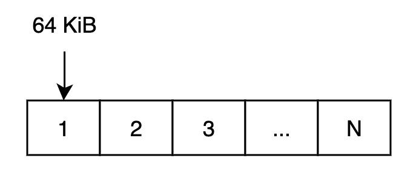
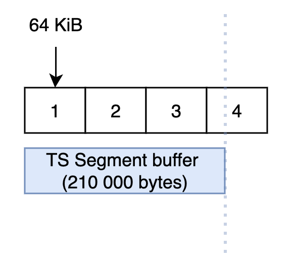
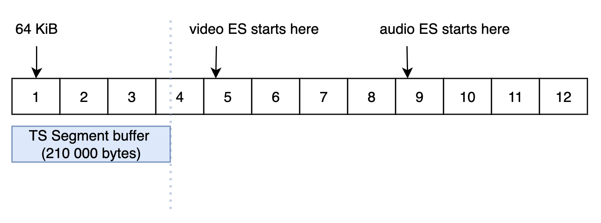
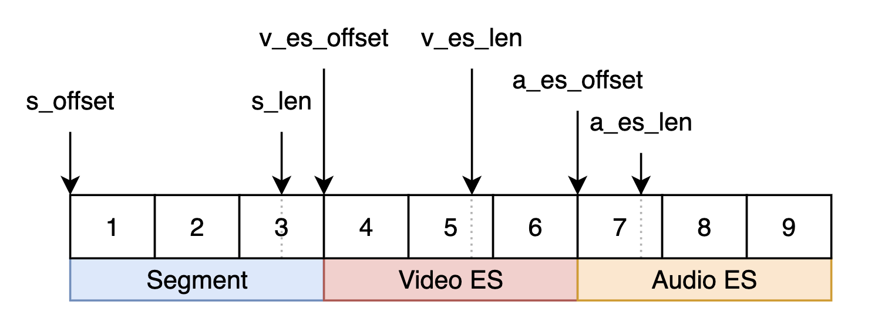

# Documentation

How does demultiplexing work? Before, we need to talk about wasm module memory.

## Memory

Module has own memory.

In order to demux an mpeg-2 ts segment, it must first be placed in the module's memory.

Memory of the module is linear and consists of blocks of 64 KiB. Blocks going strictly one after another (this is how WebAssembly works):



But initial size of blocks inside the module is zero (0 KiB)... So how do we put a segment there? It's simple )

### malloc()

Module provides a special method `malloc` for dynamic memory allocation.

You just need to specify the segment size in bytes:

```
module.malloc(210000); // 210k uint8 bytes
```

And the module will allocate the required number of blocks itself, and you don’t need to think about it:



After that, the module will automatically allocate additional blocks for Elementary Streams (for video and audio):



Each ES block size is equal to TS block size. Only in this case, ES will never overlap each other.

Technically, it will look something like this:



All these variables from the picture above are also exposed from the wasm module:

|name|description||
|---|---|---|
|s_offset|TS Segment offset|uint bytes|
|s_len|TS Segment length|uint bytes|
|v_es_offset|Video Elementary Stream offset|uint bytes|
|v_es_len|Video Elementary Stream length|uint bytes|
|a_es_offset|Audio Elementary Stream offset|uint bytes|
|a_es_len|Audio Elementary Stream length|uint bytes|

### demux()

Now everything is ready for demuxing! Next, we simply call the appropriate method:

```
module.demux();
```

*Work in progress...*